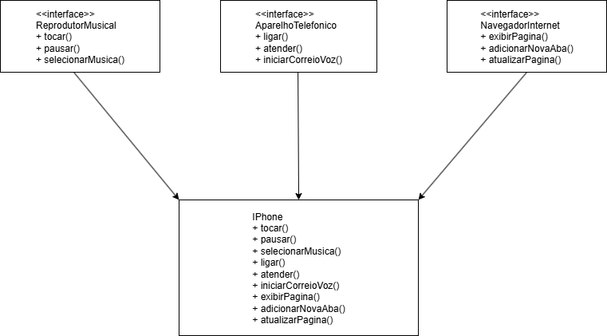

# trilha-java-basico
Este repositório foi criado para o desafio de Programação Orientada a Objetos (POO) da trilha Java Básico da DIO. O objetivo é simular um iPhone usando conceitos de POO, como interfaces e classes. O projeto inclui um diagrama UML e uma implementação em Java com funções de telefone, música e internet.

## 📊 Diagrama UML

